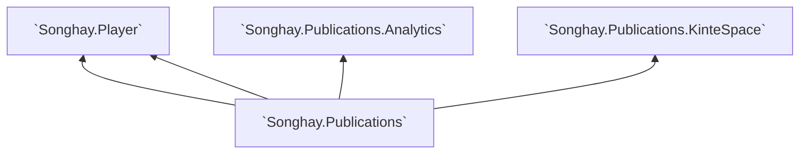

# `Songhay.Publications`

**NuGet package 📦:** [`Songhay.Publications`](https://www.nuget.org/packages/Songhay.Publications/)

**Documentation 📚:** [`Songhay.Publications` API](https://bryanwilhite.github.io/Songhay.Publications/)

## core reusable definitions for Songhay Studio Publications

Selected Songhay Studio Publications are based on automation ‘pipelines’ for static HTML and EPUB. The fundamental document format of these pipelines is markdown. It follows that the `MarkdownEntry` [class](./Songhay.Publications/Models/MarkdownEntry.cs) is a core definition of this studio.

Architecturally, the `MarkdownEntryExtensions` [class](./Songhay.Publications/Extensions/MarkdownEntryExtensions.cs) augment the `MarkdownEntry` to define [eleventy](https://www.11ty.io/)-flavored methods for generating a draft and publishing.

## `GenericWeb` models and extensions

This repo also contains the historical class definitions for a Studio project called `GenericWeb`. This was a turn-of-century, static-file generation solution using SQL-Server-based XML as a fundamental document format.

The SQL Server _schema_ for `GenericWeb` features:

- the `Segment` [[class](./Songhay.Publications/Models/Segment.cs)]
- the `Document` [[class](./Songhay.Publications/Models/Document.cs)]
- the `Fragment` [[class](./Songhay.Publications/Models/Fragment.cs)]

These class definitions are still useful (without much SQL Server or Entity Framework). In fact, the Front Matter of `MarkdownEntry` is based on the GenericWeb Document.

## `Songhay.Publications.DataAccess`

**NuGet package 📦:** [`Songhay.Publications.DataAccess`](https://www.nuget.org/packages/Songhay.Publications.DataAccess/)

`Songhay.Publications.DataAccess` adds SQLite-based Entity Framework data access for Songhay Studio Publications. This represents a renewed commitment to [SQLite](https://www.sqlite.org/index.html) in this Studio.

`Songhay.Publications.DataAccess` is stating with the `PublicationsDbContext` [class](./Songhay.Publications.DataAccess/PublicationsDbContext.cs).

## Studio packages dependent on `Songhay.Publications`

@[BryanWilhite](https://twitter.com/BryanWilhite)
